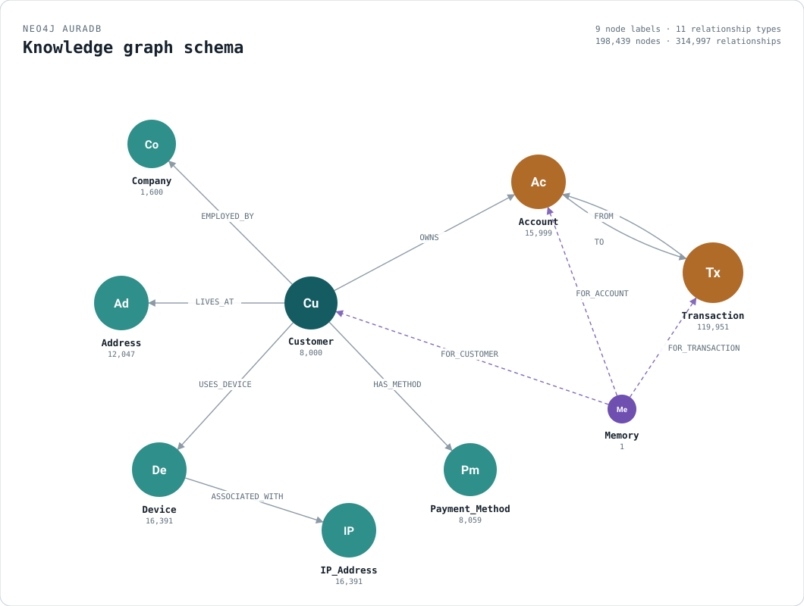

# A GraphRAG Agent - Know-Your-Customer
A basic GraphRAG agent built with OpenAI Agent SDK, Neo4j and Neo4j MCP server

See the [graph-mode schema diagram](https://atanus1502.github.io/graphrag-kyc-agent/knowledge-graph-schema.html)
for node labels, relationship types, and live counts.

# Before You Start

Before running the KYC Agent, ensure you have the following prerequisites installed and configured:

1. **Python 3.13+**
   - Download and install Python 3.13
   - Verify installation with:
   ```bash
   python --version
   ```
    

2. **uv Package Manager**
   - [Install uv](https://docs.astral.sh/uv/getting-started/installation/)
   - Verify installation with: 
   ```bash
   uv --version
   ```

3. **Ollama**
   - Ideally, you need a device with 6GB GPU Memory (the model weights take about 4.1GB)
   - [Install Ollama](https://ollama.com/download)
   - Start the Ollama server:
     ```bash
     ollama serve
     ```
   - Pull the Text-to-Cypher model:
     ```bash
     ollama pull ed-neo4j/t2c-gemma3-4b-it-q8_0-35k
     ```
   
   - Verify the model is available and being served locally
   ```bash
     ollama ls
     ```
     You should see `pull ed-neo4j/t2c-gemma3-4b-it-q8_0-35k` listed (available locally)

4. **OpenAI Key**
You will be using the OpenAI Agent SDK with an OpenAI model, so you need an OPENAI_KEY

# **Neo4j**

You have two options to create a Free Neo4j database

## Option 1: Local Neo4j Docker Instance


Start a Neo4j docker container using the provided docker-compose.yml:
```bash
docker compose up -d
```

## Option 2: Neo4j AuraDB Free (Managed Instance)

1. Head over to [Neo4j AuraDB Console](https://console.neo4j.io/)

2. Create a new database instance, Choose `AuraDB Free`.
Make sure to download your credentials.

# **Prepare to Run the Agent**

1. Clone the repository:
   ```bash
   git clone https://github.com/atanus1502/graphrag-kyc-agent.git
   cd graphrag-kyc-agent
   ```

2. Create a virtual environment and install dependencies:
   ```bash
   uv venv
   source .venv/bin/activate
   uv sync
   ```

3. Set up environment variables:
   
   Create a `.env` file with your Neo4j and OpenAI credentials:
   ```
   OPENAI_API_KEY=sk-... - Your OpenAI key
   ```

   If you are using an AuraDB Free tier instance, find the downloaded credentials.
   Look at the NEO4J_URI and locate your instance id. 

   For example, If your instance id is `NEO4J_URI=neo4j+s://4469a679.databases.neo4j.io`
   
   Your instance id is `4469a679`.

   Add the following to your `.env` file:
   ```
   NEO4J_URI=neo4j+s://<YOUR_INSTANCE_ID>.databases.neo4j.io
   NEO4J_USERNAME=<YOUR_INSTANCE_ID>
   NEO4J_PASSWORD=<YOUR_PASSWORD>
   NEO4J_DATABASE=<YOUR_INSTANCE_ID>
   ```

# **Load the dataset**
```bash
python generate_kyc_dataset.py
```

# **Run the Agent**

Start the agent:
```bash
python kyc_agent.py
```

## Run the following sequence of questions

Test the agent tools with these example questions:

1. Get the database schema:
   ```
   What is the schema of the database?
   ```
   This test the `MCP Neo4j server get schema` to fetch the schema.

2. Find suspicious rings:
   ```
   Show me 3 watchlisted customers involved in rings
   ```
   This tests the `find_customer_rings` tool.

3. Check shared addresses:
   ```
   For each of these customers, find their addresses and find out if they are shared with other customers
   ```
   This tests both the `Text-to-Cypher Generation` tool and the `MCP Neo4j server exec read query` tool.

4. Recent transactions:
   ```
   ru 
   ```
   This tests the ` get_customer_and_accounts` tool. 


5. Store conversation summary:
   ```
   Write a 300-word summary of this investigation into this customer. Store it as a memory, make sure to link it to accounts and transasction mentioned in the conversation
   ```
   This tests the `create_memory` tool.

# Knowledge Graph Schema

A graph-mode diagram of the schema (node labels, relationship types, and live counts) is available at
[`docs/knowledge-graph-schema.html`](https://atanus1502.github.io/graphrag-kyc-agent/knowledge-graph-schema.html).

**Node labels:**

| Label | Properties |
|---|---|
| `Customer` | `id`, `name`, `is_pep`, `on_watchlist` |
| `Account` | `id`, `name` |
| `Company` | `id`, `name`, `industry` |
| `Address` | `id`, `name`, `city` |
| `Device` | `id`, `name`, `os` |
| `IP_Address` | `id`, `name` |
| `Payment_Method` | `id`, `name`, `pm_type`, `card_number` |
| `Transaction` | `id`, `name`, `amount`, `timestamp` |
| `Memory` | `content`, `created_at` |

**Relationships:**

```
Customer      -[:OWNS]->             Account
Customer      -[:EMPLOYED_BY]->      Company
Customer      -[:LIVES_AT]->         Address
Customer      -[:USES_DEVICE]->      Device
Customer      -[:HAS_METHOD]->       Payment_Method
Device        -[:ASSOCIATED_WITH]->  IP_Address
Account       -[:FROM]->             Transaction
Transaction   -[:TO]->               Account
Memory        -[:FOR_CUSTOMER]->     Customer
Memory        -[:FOR_ACCOUNT]->      Account
Memory        -[:FOR_TRANSACTION]->  Transaction
```


